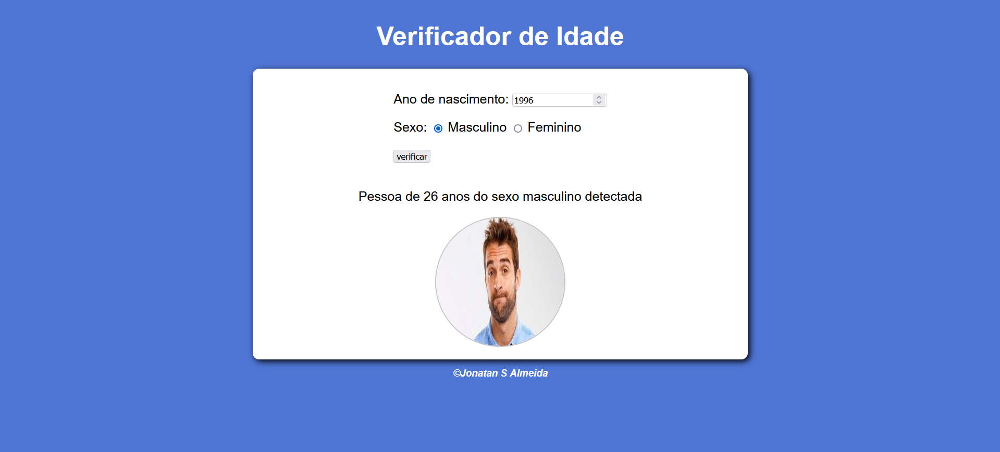

# Que horas é?

Projeto realizado no curso Curso de JavaScript do canal Curso em video.   
Instrutor: Guanabara
  

Aqui foi meu primeiro contato com javascript, nesse projeto tem dois inputs onde é feito a verificação de idade e sexo. É mostrado uma imagem e uma frase de acordo com as respostas dos inputs.

## ⚙️ Tecnologias utilizadas

- HTML 
- CSS  
- JavaScript
- Git e Github

## 🧾 Contato

Email: jonatankalmeidakk28@gmail.com  
WhatsApp: (49) 9 8435-6670
